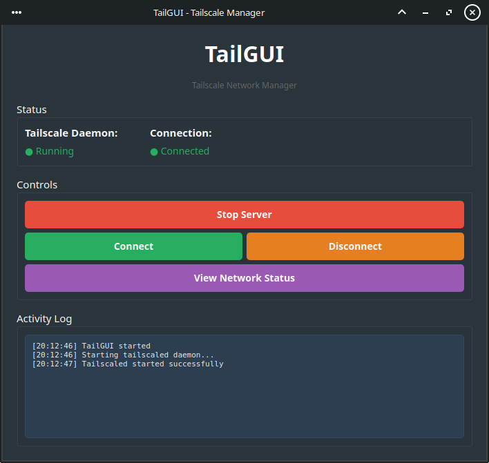

# TailGUI
Unofficial Tailscale GUI for linux, written in PyQt



## Features

- Start/Stop Tailscale daemon
- Connect/Disconnect from Tailscale network
- View network status with formatted output
- System tray integration
- Activity logging
- Support for both systemd and non-systemd systems

## Requirements

- Python 3.6+
- PyQt6
- Tailscale installed on your system

## Installation

### Dependencies

1. Install Python 3.6+

```bash
sudo apt update
sudo apt install -y python3 python3-pip
```

2. Install [tailscale](https://tailscale.com/download)

3. Clone the repo

```bash
# Clone or download TailGUI
git clone https://github.com/alexandros-m/tailgui
cd tailgui
```

4. Create python virtual env

```bash
python3 -m venv venv
source venv/bin/activate
```

5. Install pip dependencies

```bash
pip install -r requirements.txt
```

6. Make the script executable

```bash
chmod +x launcher.sh
```

# Running

```bash
./launcher.sh
```

